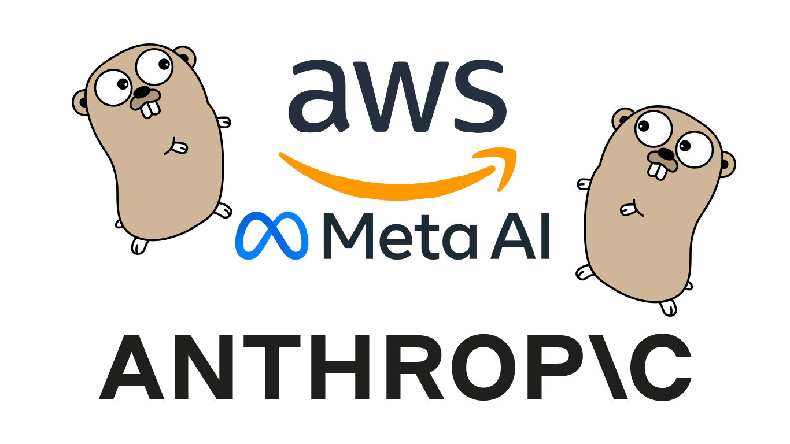

# AWS Bedrock with Go

This tutorial centers around developing a Go application for interfacing with AWS Bedrock, utilizing models such as Llama3 and Anthropic Claude.

### Prerequisites

Before starting up this project, make sure you have the necessary dependencies installed in your machine.

### Software Installation

- [x] [Go](https://go.dev/) - Go is an open source programming language that makes it simple to build secure, scalable systems.

- [x] [GoLand](https://www.jetbrains.com/go/) - More than just a Go IDE

### Tutorial

You can follow the tutorial step by step by clicking on this link -> [AI Assistant with AWS Bedrock and Go](https://www.jetbrains.com/guide/go/tutorials/bedrock_with_go/)
